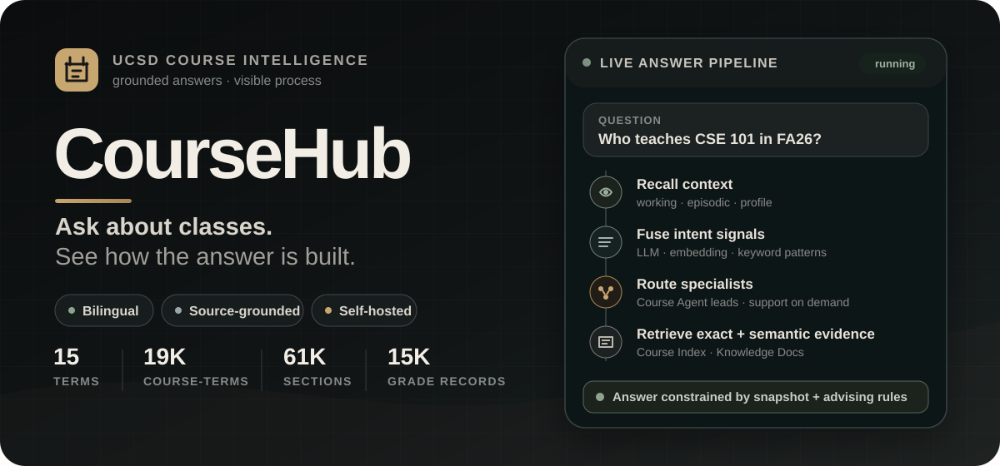
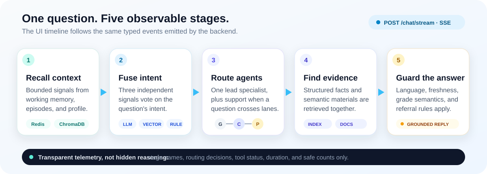

<p align="right">
  <strong>English</strong> · <a href="./README.zh-CN.md">简体中文</a>
</p>

<p align="center">
  
</p>

<p align="center">
  
  
  
  
</p>

CourseHub turns published UCSD catalog snapshots into bilingual course answers and planning guidance. Students can ask about course content, prerequisites, schedules, seats, instructors, grade history, and course sequencing in one chat interface.

It is also built to show its work: the UI exposes memory recall, three-signal intent recognition, agent routing, and tool execution as a live process timeline—without exposing private memory content or internal chain-of-thought.

<p align="center">
  
</p>

## What you can do

| Ask CourseHub to… | What happens underneath | Product boundary |
| --- | --- | --- |
| Explain a course or its prerequisites | The Course Agent combines semantic course material with structured catalog lookup | Missing catalog content is acknowledged, never invented |
| Check schedules, seats, instructors, or grades | Exact facts come from the Course Index rather than generated text | Availability always carries a snapshot timestamp; grades stay instructor × term |
| Compare options or plan a sequence | The Planning Agent grounds suggestions in catalog facts | Every planning response is unofficial and includes an advising disclaimer |
| Handle a mixed question | The orchestrator selects one lead agent and optional supporting agents | Case-specific issues are referred to official UCSD channels, not presented as a human handoff |
| Continue across conversations | Redis working memory and ChromaDB episodic memory/profile context are recalled | The timeline reports counts and status, not memory contents |

The browser chrome stays in English; answers follow the language of the question.

## Real catalog scale

CourseHub currently builds its structured index and semantic documents from the published snapshot bundled with this repository.

| Published terms | Course-term records | Sections | Grade records | Snapshot date |
| ---: | ---: | ---: | ---: | --- |
| 15 | 19,041 | 61,496 | 15,138 | 2026-08-13 |

This is static catalog data, not a live WebReg feed. CourseHub preserves that distinction in both retrieval and answer wording.

## How an answer is built

<p align="center">
  
</p>

1. **Recall context** — load bounded working memory, episodic memory, and profile signals.
2. **Understand the question** — fuse LLM classification, embedding similarity, and keyword patterns.
3. **Route specialists** — choose General, Course, or Planning as the lead and add support when useful.
4. **Retrieve evidence** — combine ChromaDB Knowledge Docs with exact Course Index queries.
5. **Answer with guardrails** — preserve data freshness, grade-history, planning, and referral constraints.

The frontend receives typed server-sent events for each real stage and collapses them into an inspectable timeline when the answer is complete.

## Quick start

### Prerequisites

- Docker with Docker Compose
- An Anthropic API key, or an API that implements the Anthropic-compatible endpoint

### Start the complete stack

```bash
cd backend
cp .env.example .env
# Add ANTHROPIC_API_KEY to .env
docker compose up -d --build
```

PowerShell equivalent for the copy step:

```powershell
Copy-Item .env.example .env
```

Then open:

- **Chat:** [http://localhost](http://localhost)
- **Developer panel:** [http://localhost/dev](http://localhost/dev)
- **Swagger API:** [http://localhost:8000/docs](http://localhost:8000/docs)
- **Prometheus:** [http://localhost:9090](http://localhost:9090)

Verify the backend:

```bash
curl http://localhost:8000/health
docker compose ps
```

If port `8000` is already occupied, set `COURSEHUB_HOST_PORT` in `backend/.env` and use that port for direct API and Swagger links. The Nginx frontend remains on port `80`.

### Try these questions

```text
What does CSE 100 cover?
Who teaches CSE 101 in FA26?
CSE 100 有哪些先修要求？
帮我规划 CSE 100 和 CSE 110 的修课顺序。
```

## Run the code directly

Frontend:

```bash
cd frontend
npm install
npm run dev
```

Backend tests and local dependencies:

```bash
cd backend
python -m pip install -r requirements-dev.txt
python -m pytest tests -q
```

Useful frontend checks:

```bash
cd frontend
npm test
npm run typecheck
npm run build
```

## Project map

```text
CourseHub/
├── backend/           FastAPI, agents, retrieval, memory, skills, evaluation
├── frontend/          React, assistant-ui, SSE timeline, local conversations
├── ucsd-course-data/  Published UCSD snapshots and source documentation
├── docs/              Complete guide, specs, ADRs, and runbooks
├── CONTEXT.md         Canonical CourseHub domain language and boundaries
└── README.zh-CN.md    Chinese project homepage
```

## Documentation

| Start here | Contents |
| --- | --- |
| [Complete guide (Chinese)](./docs/完整使用指南.md) | Deployment modes, every API, knowledge import, ChromaDB/Redis inspection, monitoring, evaluation, cleanup, and troubleshooting |
| [Local Windows runbook (Chinese)](./docs/runbooks/本地启动服务指南.md) | Copyable start, restart, port, and health-check commands |
| [Frontend guide](./frontend/README.md) | Local development, UI behavior, test commands, and source layout |
| [Frontend specification](./docs/specs/coursehub-frontend.md) | Product decisions, SSE contract, interaction rules, and acceptance criteria |
| [Hybrid retrieval ADR](./docs/adr/0001-hybrid-retrieval.md) | Why exact Course Index lookup and semantic retrieval work together |
| [SSE + assistant-ui ADR](./docs/adr/0002-custom-sse-protocol-with-assistant-ui.md) | Why CourseHub keeps a typed custom event protocol |
| [Domain context](./CONTEXT.md) | Canonical agent, intent, entity, safety, and referral terminology |

## API surface

The FastAPI service exposes both chat and operational endpoints:

```text
GET  /health            GET  /skills             POST /skills/reload
POST /chat              POST /chat/stream         POST /search
POST /knowledge/add     POST /knowledge/upload   GET  /knowledge/stats
GET  /monitor           GET  /metrics             POST /eval/run
```

Use Swagger for request schemas and the [complete guide](./docs/完整使用指南.md) for copyable examples.

## Data and safety notes

- Course facts are grounded in the repository's published SunGrid snapshot, not live UCSD systems.
- Exact schedules, availability, instructors, and grade records come from structured lookup rather than model generation.
- Availability is explicitly timestamped and described as non-real-time.
- Grade history is reported by instructor and term; CourseHub does not invent one aggregate course GPA.
- Planning guidance is unofficial. Enrollment holds, prerequisite waivers, petitions, grade disputes, and accommodations are referred to VAC, department advisors, or WebReg support.

---

CourseHub is a portfolio-ready, self-hosted demonstration of grounded multi-agent course assistance: readable for students, inspectable for developers, and honest about the limits of static data.
