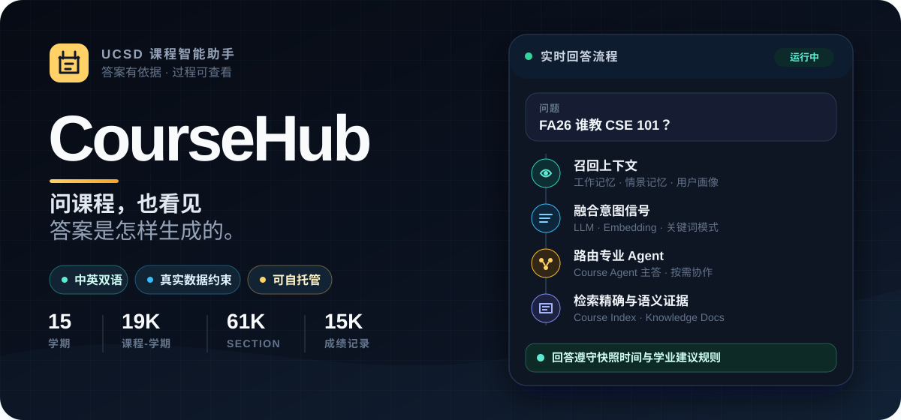
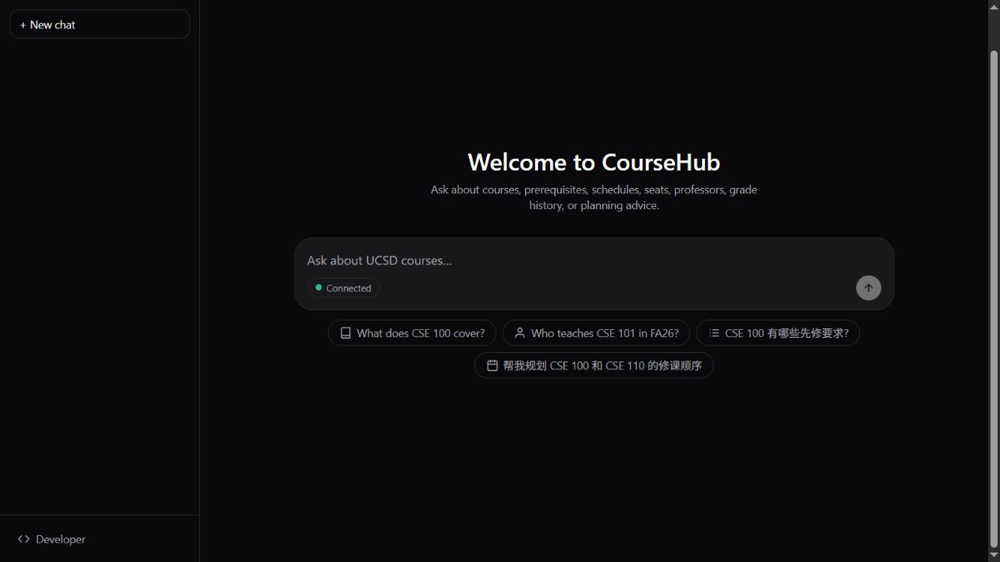
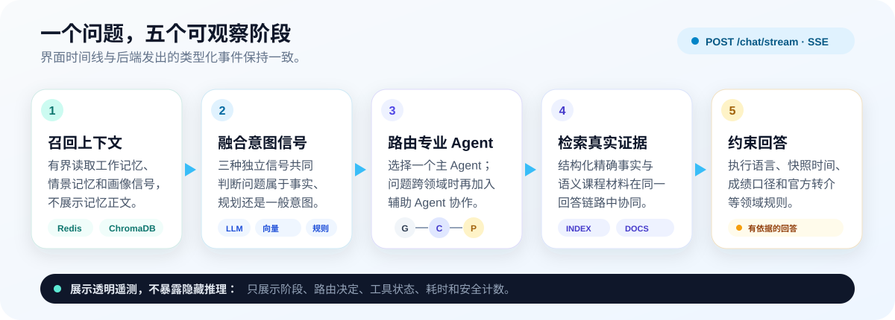

<p align="right">
  <a href="./README.md">English</a> · <strong>简体中文</strong>
</p>

<p align="center">
  
</p>

<p align="center">
  
  
  
  
  <a href="https://patricktangwen.github.io/CourseHub/zh/"></a>
</p>

<p align="center">
  <strong><a href="https://patricktangwen.github.io/CourseHub/zh/">▶ 在线体验 Demo(中文界面)</a></strong> —— 完整界面回放实录自真实本地部署的会话，无需启动后端。也可访问 <a href="https://patricktangwen.github.io/CourseHub/">English 界面版</a>。
</p>

CourseHub 把 UCSD 已发布的课程目录快照变成双语课程问答与规划建议。学生可以在同一个聊天界面询问课程内容、先修要求、上课时间、名额、授课教授、历史成绩和修课顺序。

它也会展示真实处理过程：界面通过实时过程时间线呈现记忆召回、三路意图识别、多 Agent 路由和工具执行，但不会暴露记忆正文或模型内部思维链。

<p align="center">
  
</p>

## 你可以用它做什么

| 向 CourseHub 提问…          | 系统如何处理                                              | 明确边界                                         |
| ---------------------------- | --------------------------------------------------------- | ------------------------------------------------ |
| 课程内容或先修要求           | Course Agent 结合语义课程材料与结构化目录查询             | 目录缺失的内容会明确说明，不会补写               |
| 上课时间、名额、教授或成绩   | 精确事实来自 Course Index，不由模型生成                   | 名额附快照时间；成绩保持“教授 × 学期”口径     |
| 课程对比或修课顺序           | Planning Agent 基于目录事实给出建议                       | 每次规划回答都附“非正式学业建议”免责声明       |
| 同时包含事实与规划的复合问题 | 编排器选择主 Agent，并按需加入辅助 Agent                  | 个案问题会指向 UCSD 官方渠道，不包装成“转人工” |
| 跨会话继续交流               | Redis 工作记忆与 ChromaDB 情景记忆/用户画像共同召回上下文 | 时间线只展示数量和状态，不展示记忆内容           |

界面固定使用英文 chrome；回答语言会跟随用户提问语言。

## 真实课程数据规模

CourseHub 目前从仓库内已发布的课程快照构建结构化索引和语义文档。

| 已发布学期 | 课程-学期记录 | Section | 成绩记录 | 快照日期   |
| ---------: | ------------: | ------: | -------: | ---------- |
|         15 |        19,041 |  61,496 |   15,138 | 2026-08-13 |

这些是静态目录数据，不是 WebReg 实时数据。CourseHub 在检索和回答措辞中都会保留这条边界。

## 一个回答是怎样生成的

<p align="center">
  
</p>

1. **召回上下文**：读取有界的工作记忆、情景记忆与用户画像信号。
2. **理解问题**：融合 LLM 分类、Embedding 相似度和关键词模式。
3. **路由专家**：从 General、Course、Planning 中选择主 Agent，并在需要时添加辅助 Agent。
4. **检索证据**：组合 ChromaDB Knowledge Docs 与 Course Index 精确查询。
5. **受约束地回答**：执行数据新鲜度、历史成绩、规划免责声明和官方转介规则。

前端接收每个真实阶段的类型化 SSE 事件；回答完成后，过程会收起为一条可展开检查的时间线。

## 快速开始

### 前置条件

- Docker 与 Docker Compose
- Anthropic API Key，或实现 Anthropic 兼容端点的 API Key

### 启动完整服务

```bash
cd backend
cp .env.example .env
# 在 .env 中填写 ANTHROPIC_API_KEY
docker compose up -d --build
```

PowerShell 复制命令：

```powershell
Copy-Item .env.example .env
```

启动后访问：

- **聊天界面：** [http://localhost](http://localhost)
- **开发者面板：** [http://localhost/dev](http://localhost/dev)
- **Swagger API：** [http://localhost:8000/docs](http://localhost:8000/docs)
- **Prometheus：** [http://localhost:9090](http://localhost:9090)

验证后端：

```bash
curl http://localhost:8000/health
docker compose ps
```

如果端口 `8000` 被占用，在 `backend/.env` 修改 `COURSEHUB_HOST_PORT`，并用新端口访问直连 API 和 Swagger。Nginx 前端仍使用 `80` 端口。

### 试着问这些问题

```text
What does CSE 100 cover?
Who teaches CSE 101 in FA26?
CSE 100 有哪些先修要求？
帮我规划 CSE 100 和 CSE 110 的修课顺序。
```

## 直接运行源码

前端：

```bash
cd frontend
npm install
npm run dev
```

后端测试与本地依赖：

```bash
cd backend
python -m pip install -r requirements-dev.txt
python -m pytest tests -q
```

常用前端检查：

```bash
cd frontend
npm test
npm run typecheck
npm run build
```

## 项目结构

```text
CourseHub/
├── backend/           FastAPI、Agents、检索、记忆、Skills、评测
├── frontend/          React、assistant-ui、SSE 时间线、本地会话
├── ucsd-course-data/  已发布 UCSD 快照与来源文档
├── docs/              完整指南、Specs、ADR 与运维 Runbook
├── CONTEXT.md         CourseHub 领域语言与边界的权威定义
└── README.md          English project homepage
```

## 文档导航

| 从这里开始                                                                        | 内容                                                                        |
| --------------------------------------------------------------------------------- | --------------------------------------------------------------------------- |
| [完整使用指南](./docs/完整使用指南.md)                                             | 部署模式、全部 API、知识库导入、ChromaDB/Redis 查看、监控、评测、清理和排障 |
| [Windows 本地启动指南](./docs/runbooks/本地启动服务指南.md)                        | 可复制的启动、重启、端口和健康检查命令                                      |
| [前端开发指南](./frontend/README.md)                                               | 本地开发、界面行为、测试命令和源码结构                                      |
| [前端 Spec](./docs/specs/coursehub-frontend.md)                                    | 产品决策、SSE 协议、交互规则与验收标准                                      |
| [混合检索 ADR](./docs/adr/0001-hybrid-retrieval.md)                                | 为什么 Course Index 精确查询与语义检索需要协同工作                          |
| [SSE + assistant-ui ADR](./docs/adr/0002-custom-sse-protocol-with-assistant-ui.md) | 为什么 CourseHub 保留类型化的自定义事件协议                                 |
| [领域上下文](./CONTEXT.md)                                                         | Agent、意图、实体、安全约束和官方转介的标准术语                             |

## API 一览

FastAPI 同时提供聊天与运维端点：

```text
GET  /health            GET  /skills             POST /skills/reload
POST /chat              POST /chat/stream         POST /search
POST /knowledge/add     POST /knowledge/upload   GET  /knowledge/stats
GET  /monitor           GET  /metrics             POST /eval/run
```

请求结构请查看 Swagger；可复制示例与完整操作说明见[完整使用指南](./docs/完整使用指南.md)。

## 数据与安全说明

- 课程事实来自仓库内已发布的 SunGrid 静态快照，不是 UCSD 实时系统。
- 精确的时间、名额、教授和成绩记录来自结构化查询，不由模型生成。
- 名额回答必须带快照时间，并明确标注“非实时”。
- 历史成绩按教授和学期展示；CourseHub 不生成一个聚合的“课程平均 GPA”。
- 规划建议不是正式学业指导。选课 Hold、先修豁免、Petition、成绩争议和特殊支持会转介到 VAC、院系 Advisor 或 WebReg Support。

---

CourseHub 是一个可自托管、适合作品集展示的多 Agent 课程助手：学生能直接使用，开发者能检查真实过程，静态数据的能力边界也始终说得清楚。
